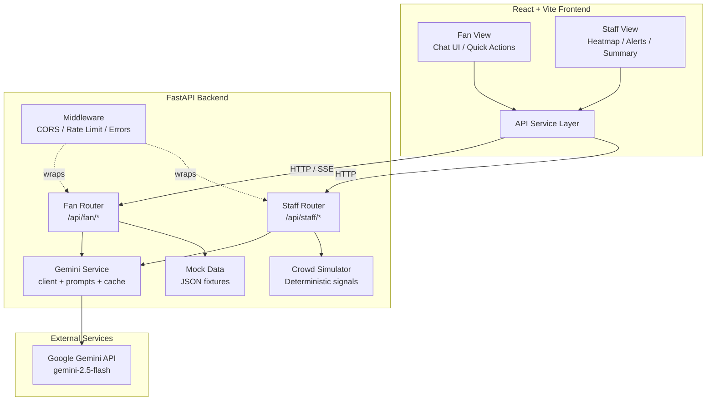

# ⚡ FanPulse AI — GenAI Stadium Companion & Operations Copilot

> **FIFA World Cup 2026 | Powered by Google Gemini**

## Problem Statement

The FIFA World Cup 2026 will host millions of fans across multiple venues, creating
unprecedented challenges in stadium navigation, crowd management, accessibility,
transportation coordination, and sustainability. Fans need real-time, multilingual
assistance navigating unfamiliar venues. Operations staff need AI-powered intelligence
to manage crowd flow, respond to incidents, and maintain safe, efficient operations.

## Solution

**FanPulse AI** is a GenAI-powered stadium companion platform with two integrated views:

1. **Fan View** — A multilingual AI concierge that helps fans with wayfinding,
   accessibility needs, transportation, sustainability information, and general
   stadium FAQs. Automatically detects the fan's language and responds in kind.

2. **Staff View** — An operational intelligence command center that analyzes
   simulated real-time crowd density data, generates AI-powered recommendations,
   severity-tagged alerts, and end-of-shift summary reports.

Both views share a single Gemini-based backend service layer, demonstrating how one
GenAI architecture can serve multiple stakeholder needs simultaneously.

> **Note:** All real-time data is synthetically generated for demonstration purposes.
> No real stadium sensor data is used or collected.

---

## 🏟️ Challenge Category Mapping

| Challenge Category | Feature | Location |
|---|---|---|
| **Navigation** | AI wayfinding — step-by-step directions between sections/gates | `backend/app/gemini/prompts.py`, Fan chat |
| **Crowd Management** | Crowd density heatmap + AI analysis + threshold alerts | `backend/app/data/simulator.py`, Staff view |
| **Accessibility** | Wheelchair routes, quiet rooms, prayer rooms, high-contrast/large-text modes | `backend/app/data/fixtures/facilities.json`, `useAccessibility` hook |
| **Transportation** | Shuttle/metro schedule lookups, parking info, rideshare directions | `backend/app/data/fixtures/transport.json`, Fan chat |
| **Sustainability** | Water refill stations, recycling points, green initiatives | `backend/app/data/fixtures/facilities.json`, Fan chat |
| **Multilingual Assistance** | Auto-detects fan language, responds in same language via Gemini | `backend/app/gemini/prompts.py` system prompt |
| **Operational Intelligence** | AI-generated analysis of crowd patterns + shift summary reports | `backend/app/routers/staff.py`, Staff view |
| **Real-time Decision Support** | Live alerts, crowd redirection recommendations, weather advisories | `backend/app/routers/staff.py` alerts endpoint |

---

## 📊 Judging Criteria Alignment

| Criterion | Evidence | Key Files |
|---|---|---|
| **Code Quality** | Clean modular structure, consistent naming, docstrings, linter configs committed and passing (Ruff, Black, mypy, ESLint, Prettier) | `backend/pyproject.toml`, `frontend/eslint.config.js`, `.github/workflows/ci.yml` |
| **Problem Alignment** | This table + Challenge Category table above — every category mapped to concrete features | `README.md` |
| **Security** | API key in env vars only, Pydantic validation, rate limiting (slowapi), explicit CORS, generic error responses, Gemini safety settings, no eval/exec, input delimiting in prompts | `backend/app/config.py`, `backend/app/main.py`, `backend/app/middleware/error_handler.py`, `backend/app/gemini/prompts.py` |
| **Efficiency** | Async Gemini calls (client.aio), LRU cache for FAQs, SSE streaming for chat, debounced input, paginated/capped endpoints | `backend/app/gemini/cache.py`, `backend/app/gemini/client.py`, `frontend/src/hooks/useDebounce.js` |
| **Testability** | pytest (backend — 4 test files, 35+ tests), Vitest + Testing Library (frontend), CI workflow | `backend/tests/`, `frontend/src/test/`, `.github/workflows/ci.yml` |
| **Accessibility** | WCAG-conscious: semantic HTML, ARIA labels, keyboard nav, high-contrast toggle, large-text toggle, screen-reader-safe output, hidden data tables for heatmap | `frontend/src/index.css`, `frontend/src/hooks/useAccessibility.js`, `frontend/src/components/staff/CrowdHeatmap.jsx` |
| **Repo < 10 MB** | No bundled models, no large datasets, SVG heatmap (no chart libs), comprehensive .gitignore | `.gitignore` |
| **GenAI Mandatory** | Gemini is load-bearing for fan chat, staff analysis, shift summaries, and language detection — not decorative | `backend/app/gemini/` |

---

## 🏗️ Architecture



---

## 🚀 Quick Start

### Prerequisites

- **Python 3.11+** with `pip`
- **Node.js 20+** with `npm`
- **Google Gemini API Key** — get one at [aistudio.google.com/apikey](https://aistudio.google.com/apikey)

### Setup (< 5 minutes)

```bash
# 1. Clone the repo
git clone <repo-url>
cd fanpulse-ai

# 2. Backend setup
cd backend
python -m venv .venv
# Windows:
.venv\Scripts\activate
# macOS/Linux:
# source .venv/bin/activate
pip install -r requirements.txt

# 3. Configure environment
cp ../.env.example .env
# Edit .env and add your GEMINI_API_KEY

# 4. Start backend
uvicorn app.main:app --reload --port 8000

# 5. Frontend setup (new terminal)
cd ../frontend
npm install
npm run dev
```

Open **http://localhost:5173** — you'll see the Fan View with the AI concierge.

Click **Staff View** in the header to see the Command Center.

---

## 📁 Project Structure

```
fanpulse-ai/
├── .github/workflows/ci.yml     # CI: lint + test on push
├── .env.example                 # Environment template
├── .gitignore                   # Comprehensive exclusions
├── LICENSE                      # MIT
├── README.md                    # This file
├── ARCHITECTURE.md              # Detailed data flow docs
│
├── backend/
│   ├── app/
│   │   ├── config.py            # Pydantic settings from env vars
│   │   ├── main.py              # FastAPI app entry point
│   │   ├── gemini/
│   │   │   ├── client.py        # Gemini client + safety settings
│   │   │   ├── prompts.py       # System prompts + templates
│   │   │   └── cache.py         # LRU cache for FAQs
│   │   ├── models/
│   │   │   ├── fan.py           # Pydantic models (chat, facilities)
│   │   │   └── staff.py         # Pydantic models (analysis, alerts)
│   │   ├── routers/
│   │   │   ├── fan.py           # Fan endpoints (chat, data)
│   │   │   └── staff.py         # Staff endpoints (crowd, AI analysis)
│   │   ├── data/
│   │   │   ├── fixtures/        # Mock JSON data (< 5 KB each)
│   │   │   └── simulator.py     # Deterministic crowd signal generator
│   │   └── middleware/
│   │       └── error_handler.py # Generic error responses
│   ├── tests/                   # pytest tests (all Gemini calls mocked)
│   ├── requirements.txt         # Pinned dependencies
│   └── pyproject.toml           # Ruff + Black + mypy config
│
└── frontend/
    ├── src/
    │   ├── App.jsx              # Router: /fan, /staff
    │   ├── index.css            # Design system + CSS variables
    │   ├── components/
    │   │   ├── common/Header    # Navigation + a11y controls
    │   │   ├── fan/             # Chat UI components
    │   │   └── staff/           # Command Center components
    │   ├── hooks/               # useChat, useDebounce, useAccessibility
    │   ├── services/api.js      # Backend API client
    │   └── test/                # Vitest component tests
    ├── eslint.config.js         # ESLint flat config
    ├── .prettierrc              # Prettier config
    └── vite.config.js           # Vite + vitest config
```

---

## 🧪 Running Tests

```bash
# Backend tests
cd backend
.venv/Scripts/activate  # or source .venv/bin/activate
pytest -v

# Frontend tests
cd frontend
npx vitest run

# Linting
cd backend && ruff check . && black --check .
cd frontend && npx eslint src/ && npx prettier --check "src/**/*.{js,jsx,css}"
```

---

## 🎥 Demo Video

> *Link to demo video will be added here*

---

## 📄 License

MIT — see [LICENSE](./LICENSE)
